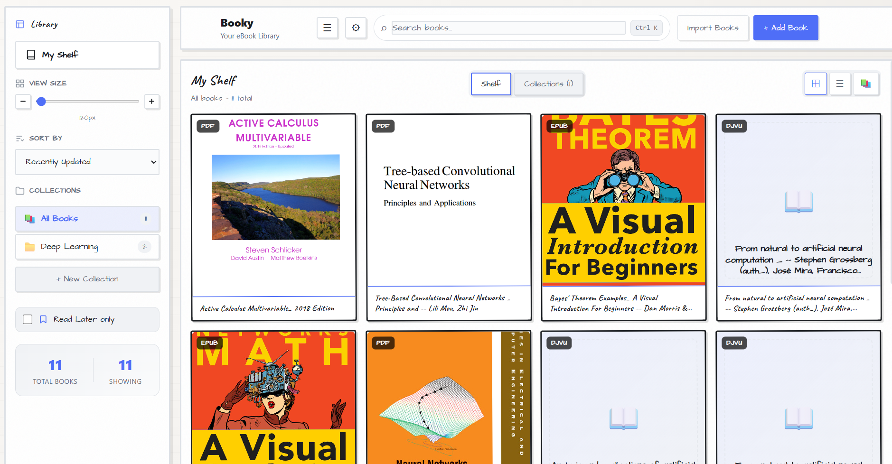
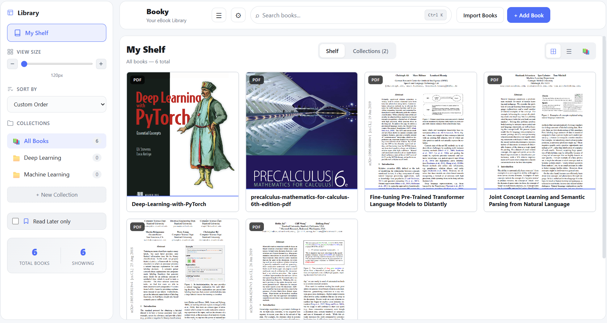
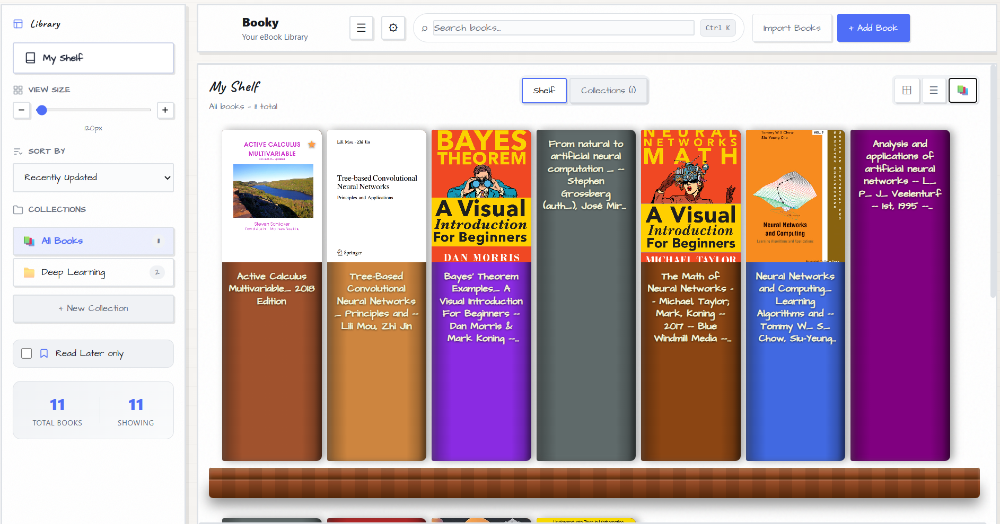

<div align="center">

# 📚 Booky

### Your Personal eBook Library Manager

[](https://react.dev/)
[](https://www.typescriptlang.org/)
[](https://vitejs.dev/)
[](LICENSE)

**A beautiful, modern ebook library manager with built-in readers, PDF tools, and support for 7+ formats.**

[Features](#-features) • [Demo](#-demo) • [Installation](#-installation) • [Usage](#-usage) • [Screenshots](#-screenshots)

---

</div>

## ✨ Features

<table>
<tr>
<td width="50%">

### 📖 Multi-Format Support
- **PDF** - Full-featured reader with text highlights
- **EPUB** - Beautiful reflowable text
- **MOBI** - Kindle format support
- **FB2** - Fiction Book format
- **CBZ** - Comic book archives
- **AZW3** - Amazon Kindle format
- **DJVU** - Continuous scroll with professional zoom

</td>
<td width="50%">

### 🎨 Beautiful Interface
- **Multiple Themes** - Light, Dark, Sepia, Nord, Dracula
- **View Modes** - Grid, List, Compact views
- **Sketch Styles** - Hand-drawn book covers
- **Responsive Design** - Works on any screen size
- **Smooth Animations** - Polished user experience

</td>
</tr>
<tr>
<td width="50%">

### 📂 Library Organization
- **Collections** - Create custom book collections
- **Search** - Find books instantly
- **Metadata Editing** - Update book info
- **Auto Cover Extraction** - From PDFs automatically
- **Reading Progress** - Track where you left off

</td>
<td width="50%">

### 🛠️ PDF Power Tools
- **Compress** - Reduce file size
- **Rotate** - Rotate pages
- **Extract Pages** - Split PDFs
- **OCR** - Make searchable
- **Watermark** - Add text overlays
- **Convert to Images** - Export as PNG/JPEG

</td>
</tr>
</table>

---

## 🎬 Demo

### 🌐 [**Live Demo →**](https://programming2055.github.io/Booky/)

> **Note:** The demo runs entirely in your browser. Add some ebooks to try it out!

### Run Locally

```bash
git clone https://github.com/Programming2055/Booky.git
cd Booky
npm install
npm start
```

---

## 📸 Screenshots

<div align="center">

### 📚 Library View
*Organize your ebooks with beautiful cover displays, multiple themes, and collection management.*



---

### 📖 Reader View
*Full-featured reader with highlights, annotations, zoom, and page navigation.*



---

### 📂 Collections
*Create custom collections and organize your library your way.*



</div>

---

## 🚀 Installation

### Prerequisites

- **Node.js 18+** - [Download](https://nodejs.org/)
- **Python 3.8+** *(optional)* - For DJVU/PDF system app integration

### Quick Start

```bash
# Clone the repository
git clone https://github.com/Programming2055/Booky.git
cd Booky

# Install dependencies
npm install

# Optional: Install Python dependencies for system app integration
pip install flask flask-cors

# Start the app
npm start
```

### Windows Users
Simply double-click `start.bat` to launch everything!

---

## 📖 Usage

### Adding Books

1. Click the **+ Add Book** button in the header
2. Select your ebook files (PDF, EPUB, MOBI, etc.)
3. Books are automatically added with cover extraction

### Reading Books

- **Click** any book cover to open in the built-in reader
- Use **arrow keys** or click edges to navigate pages
- Press **Escape** to close the reader

### Organizing Collections

1. Click **+ New Collection** in the sidebar
2. Drag and drop books into collections
3. Right-click collections to rename or delete

### Using PDF Tools

1. Open any PDF in the reader
2. Click the **🔧 Tools** button in the toolbar
3. Select a tool (requires [Stirling-PDF](#pdf-tools-setup))

---

## ⌨️ Keyboard Shortcuts

| Shortcut | Action |
|----------|--------|
| `←` / `→` | Previous / Next page |
| `Escape` | Close reader |
| `+` / `-` | Zoom in / out |
| `Ctrl + F` | Search in book |

---

## 📋 Format Support

| Format | Built-in Reader | System App | Notes |
|--------|:---------------:|:----------:|-------|
| PDF | ✅ | ✅ | Text selection & highlights |
| EPUB | ✅ | - | Reflowable text, TOC support |
| MOBI | ✅ | - | Kindle format |
| FB2 | ✅ | - | Fiction Book format |
| CBZ | ✅ | - | Comic book archive |
| AZW3 | ✅ | - | Amazon Kindle |
| DJVU | ✅ | ✅ | Vertical scroll, fit-width/fit-page zoom |

---

## 🔧 PDF Tools Setup

Booky integrates with [Stirling-PDF](https://github.com/Stirling-Tools/Stirling-PDF) for advanced PDF operations.

### Using Docker (Recommended)

```bash
docker run -d -p 8080:8080 --name stirling-pdf frooodle/s-pdf:latest
```

### Using Docker Compose

```yaml
services:
  stirling-pdf:
    image: frooodle/s-pdf:latest
    ports:
      - "8080:8080"
    restart: unless-stopped
```

Once running, the **🔧 Tools** button in the PDF reader will be active!

---

## 🏗️ Tech Stack

<div align="center">

| Technology | Purpose |
|------------|---------|
|  | UI Framework |
|  | Type Safety |
|  | Build Tool |
|  | Local Storage |
|  | PDF Rendering |
|  | EPUB/MOBI Reader |
|  | Python Server |

</div>

---

## 📁 Project Structure

```
booky/
├── 📂 public/
│   ├── 📂 foliate-js/      # EPUB/MOBI reader engine
│   ├── djvu.js             # DJVU support
│   └── booky-icon.svg      # App icon
├── 📂 server/
│   └── ebook_server.py     # Python server for system apps
├── 📂 src/
│   ├── 📂 components/
│   │   ├── BookCard/       # Book cover cards
│   │   ├── BookGrid/       # Library grid view
│   │   ├── EbookReader/    # EPUB/MOBI/FB2 reader
│   │   ├── PdfReader/      # PDF reader with highlights
│   │   ├── PdfTools/       # Stirling-PDF integration
│   │   ├── CollectionTree/ # Sidebar collections
│   │   └── ...
│   ├── 📂 context/         # React context (state)
│   ├── 📂 services/        # IndexedDB, API services
│   └── 📂 types/           # TypeScript definitions
├── package.json
└── README.md
```

---

## 🤝 Contributing

Contributions are welcome! Here's how you can help:

1. **Fork** the repository
2. **Create** a feature branch (`git checkout -b feature/amazing-feature`)
3. **Commit** your changes (`git commit -m 'Add amazing feature'`)
4. **Push** to the branch (`git push origin feature/amazing-feature`)
5. **Open** a Pull Request

### Ideas for Contributions

- [ ] Cloud sync support
- [ ] Book recommendations
- [ ] Reading statistics
- [ ] Annotation export
- [ ] More themes

---

## 📄 License

This project is licensed under the MIT License - see the [LICENSE](LICENSE) file for details.

---

## 🙏 Acknowledgments

- [Foliate-js](https://github.com/johnfactotum/foliate-js) - EPUB rendering engine
- [PDF.js](https://github.com/nicholasweston/pdf-viewer-reactjs) - PDF rendering
- [Stirling-PDF](https://github.com/Stirling-Tools/Stirling-PDF) - PDF tools
- [DjVu.js](https://djvu.js.org/) - DJVU support

---

<div align="center">

**Made with ❤️ for book lovers**

⭐ Star this repo if you find it useful!

</div>
